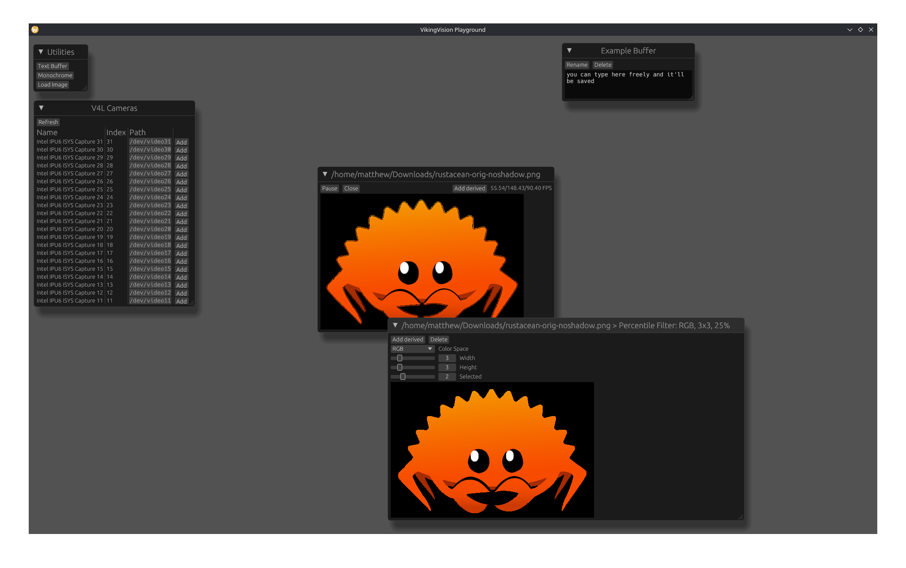

# Using the Playground

The playground serves as a "test area" for image processing tools. It's not as powerful as the full Rust API or even the pipeline system, but it should expose all of the basic image processing steps that can be done through an easy-to-use UI.

## Available Cameras

This shows a live-updating view of V4L cameras as they update. Adding a camera will create a new floating window for it.

## Utilities

In addition to showing actual cameras, some additional utilities are available:

### Text Buffers

Text buffers act as small scratchpads for taking notes directly in the app. They're autosaved, too!

### Monochrome Cameras

Probably the fastest way to test the performance of various processing steps is a still image of a single color. You can select a color and resize the image freely. This frame is treated like a camera.

### Static Images

While monochrome cameras are useful for simple performance testing, using a static image is useful because it can show the actual effects of a process on an image. It's also useful because it doesn't require a physical camera to be plugged in and has easily reproducible results. Currently, only JPEG and PNG images are supported, although more could be supported in the future if the need arises.

## Camera Controls

Each camera runs on its own thread, which allows them to run more-or-less independently of each other and show the performance of each process (although many image processing steps use a shared thread pool, so performance will fall somewhat if multiple cameras are used). This thread can be independently paused and resumed, and the camera can be closed altogether.

In addition, a framerate counter is shown. This shows the minimum, maximum, and average framerate over the last ten seconds.

## Derived Frames

A derived frame takes a previous frame and applies some basic transformation to it. Multiple steps can be performed, and the time required to do all of them is shown in the framerate counter. Note that this is different from the behavior of the pipeline runner, in which processing is done asynchronously to further improve performance.
